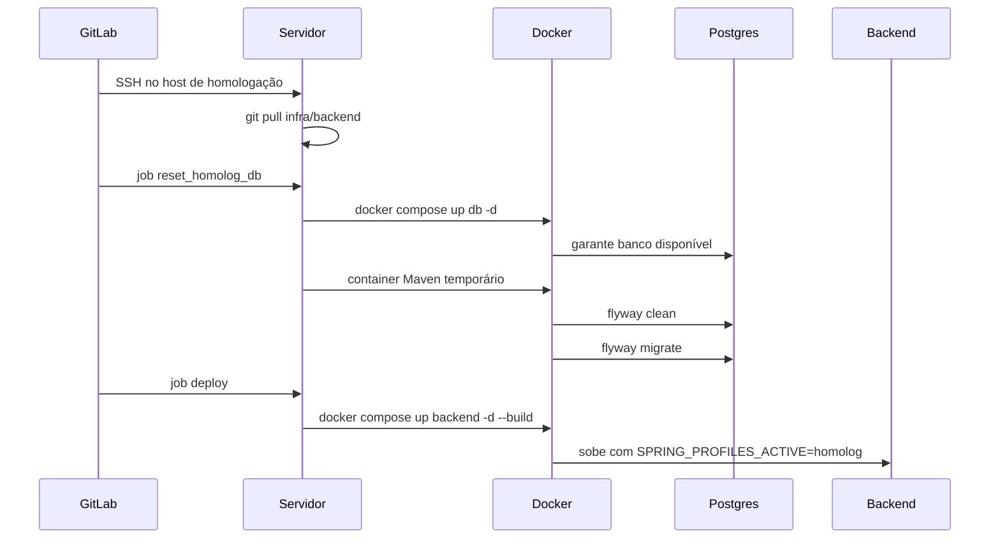

# Padrões de Projeto de Software

## 1. O que é padrão de projetos?
Com início na arquitetura através da observação, rapidamente importado para o desenvolvimento de software.

Cada padrão descreve um problema que ocorre frequentemente em seu ambiente, e então descreve o cerne da solução ára aquele problema, de um modo talque vocêpode usar esta solução milhões de vezes, sem nunca fazer a mesma coisa repetida.

**Christopher Alexander**

## 2. Entendendo os Diagramas


# Banco de homologação com Flyway

## 1. Resumo 

Foi implementada uma estratégia de **versionamento, reset e seed automatizado do banco de dados em homologação**.

O objetivo é garantir que, a cada deploy de homologação, o banco possa ser reconstruído de forma previsível:

1. A base é limpa.
2. A estrutura é recriada por migrations versionadas.
3. Dados mínimos obrigatórios são inseridos.
4. O seed de homologação cria o usuário inicial.
5. Os testes automatizados podem popular os demais dados de negócio.

Essa abordagem foi desenhada para **homologação e desenvolvimento local**. 

---

## 2. Motivação

Antes da mudança, o ambiente de homologação dependia de uma base com histórico acumulado, dumps e scripts manuais.

Isso gerava alguns riscos:

- dados antigos interferindo nos testes;
- dificuldade para reproduzir erros;
- deploy sem garantia de alinhamento entre aplicação e schema;
- dependência de população manual da base;
- testes E2E vulneráveis ao estado anterior do banco.

A solução adotada foi tornar o banco de homologação **reprodutível**: sempre possível de recriar do zero usando código versionado.

---

## 3. Arquitetura da solução

O Flyway passou a ser a ferramenta responsável por organizar a evolução do banco.


### Responsabilidade de cada camada

| Camada | Responsabilidade |
|---|---|
| `V001` | Criar a estrutura inicial do banco |
| `V002` | Inserir dados mínimos de referência |
| `R__homolog_users.sql` | Criar o usuário mínimo de homologação |
| Pipeline | Executar `clean + migrate` apenas em homologação |
| Backend | Validar e aplicar migrations pendentes no startup |
| Testes E2E | Criar os dados de negócio necessários aos cenários |

---

## 4. Arquivos criados ou alterados

### Dependências

Arquivo:

```text
pom.xml
```

Foram adicionadas dependências do Flyway:

- `flyway-core`;
- `flyway-database-postgresql`.

Com isso, o Spring Boot passa a integrar o Flyway no ciclo de inicialização da aplicação.

---

### Configuração base do Flyway

Arquivo:

```text
src/main/resources/application.yml
```

Configuração principal:

```yaml
spring:
  flyway:
    enabled: true
    locations: classpath:db/migration
    baseline-on-migrate: true
    baseline-version: 1
    clean-disabled: true
```

Pontos importantes:

- o Flyway fica habilitado;
- migrations ficam em `db/migration`;
- `clean-disabled: true` protege a aplicação contra limpeza automática no startup;
- o `clean` só é executado por scripts/pipeline de forma explícita.

---

### Configuração de homologação

Arquivo:

```text
src/main/resources/application-homolog.yml
```

Configuração:

```yaml
spring:
  jpa:
    defer-datasource-initialization: false
  flyway:
    locations:
      - classpath:db/migration
      - classpath:db/seed/homolog
```

Essa configuração faz duas coisas:

- evita o ciclo entre JPA e Flyway;
- inclui os seeds específicos de homologação.

Para funcionar corretamente no container, o backend precisa subir com:

```yaml
SPRING_PROFILES_ACTIVE: homolog
```

---

### Configuração local de desenvolvimento

Arquivo:

```text
src/main/resources/application-dev.properties
```

Ajustes principais:

```properties
spring.jpa.defer-datasource-initialization=false
spring.flyway.locations=classpath:db/migration,classpath:db/seed/homolog
```

Motivo:

- evitar ciclo JPA/Flyway localmente;
- permitir que o backend local reconheça o seed aplicado pelo reset local.

---

## 5. Migrations versionadas

### `V001__baseline_homolog_schema.sql`

Arquivo:

```text
src/main/resources/db/migration/V001__baseline_homolog_schema.sql
```

Responsabilidade:

- criar a estrutura inicial do banco;
- tabelas;
- constraints;
- sequences;
- índices;
- funções;
- relacionamentos.

Essa migration foi criada com base no dump estrutural da homologação.

Durante os testes, foi identificado e corrigido um problema no SQL original:

```sql
UPDATE reuniao
   SET localizacao = NEW.localizacao,
       status = NEW.status,
       tipo_reuniao = NEW.tipo_reuniao,
       updated_at = CURRENT_TIMESTAMP
 WHERE id_reuniao_origem = NEW.id;
```

O dump original tinha um `UPDATE` sem `SET`, o que quebrava o `migrate` após um `clean`.

---

### `V002__reference_access_data.sql`

Arquivo:

```text
src/main/resources/db/migration/V002__reference_access_data.sql
```

Responsabilidade:

- inserir dados mínimos de referência;
- perfis;
- permissões necessárias para autenticação/autorização.

Esses dados são tratados como **dados estruturais obrigatórios**, por isso ficam em migration versionada.

---

## 6. Seed de homologação

Arquivo:

```text
src/main/resources/db/seed/homolog/R__homolog_users.sql
```

Responsabilidade:

- criar ou atualizar o usuário mínimo de homologação;
- login: `user`;
- senha: `123`;
- perfil: administrador.

Esse seed é um arquivo `R__`, ou seja, uma migration repeatable do Flyway.

Características:

- roda quando ainda não foi aplicado;
- roda novamente se o conteúdo do arquivo mudar;
- é idempotente;
- não deve conter dados de negócio complexos;
- deve permanecer pequeno e previsível.

---

## 7. Diferença entre migration e seed

| Tipo | Exemplo | Quando usar |
|---|---|---|
| Migration versionada | `V003__add_coluna_status.sql` | Mudança estrutural ou dado obrigatório |
| Seed repeatable | `R__homolog_users.sql` | Dados mínimos de ambiente/teste |
| Teste E2E | Playwright criando casos/alvos | Dados de negócio usados nos cenários |

Regra prática:

- estrutura do banco entra em `V...`;
- dados obrigatórios do sistema entram em `V...`;
- dados mínimos de homologação entram em `R__...`;
- massa de teste de negócio deve ser criada pelos próprios testes.

---

## 8. Evolução futura do banco

Novas mudanças devem ser feitas criando novas migrations:

```text
V003__descricao_da_mudanca.sql
V004__outra_mudanca.sql
V005__nova_referencia.sql
```

Exemplo:

```sql
ALTER TABLE public.caso
  ADD COLUMN campo_x varchar(255);
```

Regras:

- migrations já aplicadas não devem ser editadas;
- se algo mudou, cria-se uma nova migration;
- a ordem é controlada pelo prefixo `V001`, `V002`, `V003`, etc.;
- em banco novo, o Flyway roda tudo desde `V001`;
- em banco existente, o Flyway roda apenas o que ainda não foi aplicado.

---

## 9. Reset local

Foi criado um script para desenvolvimento local.

Arquivo:

```text
reset-local-db.ps1
```

Uso:

```powershell
.\reset-local-db.ps1
```

Uso sem confirmação:

```powershell
.\reset-local-db.ps1 -Force
```

O script executa:

```text
flyway clean
flyway migrate
```

Com locations:

```text
src/main/resources/db/migration
src/main/resources/db/seed/homolog
```


---

## 11. Reset em homologação

Foi criado um script para o servidor de homologação.

Arquivo:

```text
reset-homolog-db.sh
```

Responsabilidade:

- garantir que o container do PostgreSQL está em execução;
- descobrir a rede Docker do banco;
- executar um container Maven temporário;
- rodar `flyway clean + migrate`;
- aplicar migrations e seeds.

O script exige a variável:

```bash
RESET_HOMOLOG_DB=true
```

Sem essa variável, ele bloqueia a execução.

---

## 12. Pipeline GitLab

O pipeline foi separado em três etapas:

```text
test -> database -> deploy
```

### Job `test`

Executa os testes Maven.

### Job `reset_homolog_db`

Executa o reset do banco de homologação.

Esse job:

- acessa o servidor via SSH;
- atualiza os repositórios;
- executa `reset-homolog-db.sh`;
- falha se o reset falhar.

### Job `deploy`

Recria o container do backend somente depois do reset bem-sucedido.

---

## 13. Fluxo completo de homologação - Backend



---


## 18. Checklist operacional

Antes de considerar o fluxo fechado:

- [x] `SPRING_PROFILES_ACTIVE=homolog` versionado no repositório de infra;
- [x] job `reset_homolog_db` rodando antes do deploy;
- [x] backend subindo sem erro após reset;
- [x] login `user / 123` funcionando;
- [x] Playwright configurado para o usuário seed;
- [x] testes E2E populando dados de negócio - Usuários, Casos, Mandados, Mandados Avulsos;


---

