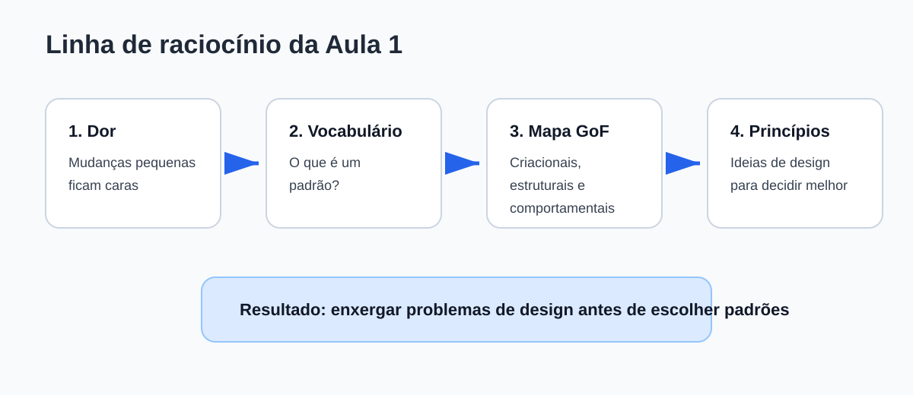
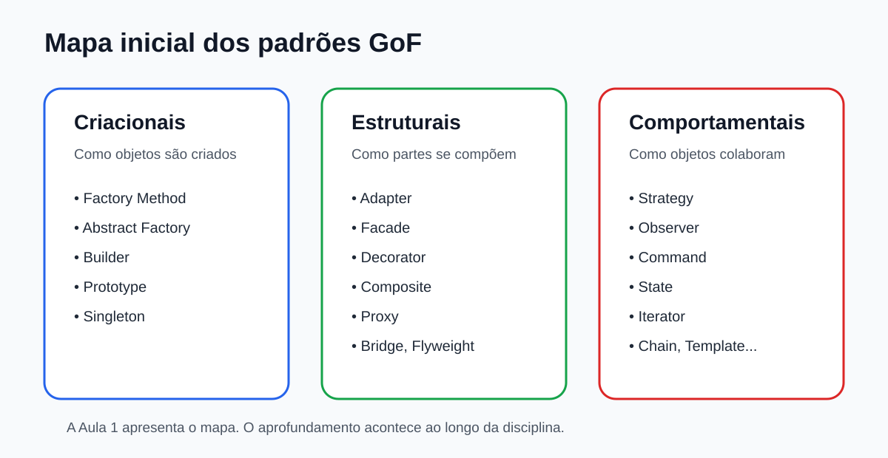

# Padrões de Projeto de Software

## Aula 01 - Pensamento de design antes dos padrões

Java

> **Ideia central:** antes de estudar padrões específicos, vamos aprender a reconhecer problemas de design e a justificar melhorias.

## Organização da aula

A aula está organizada em cinco etapas:

| Etapa | Tipo | Foco |
|---:|---|---|
| 1 | Teoria | Por que padrões existem? |
| 2 | Exercício | Diagnóstico de código difícil de manter |
| 3 | Teoria | Padrões, GoF e princípios de design |
| 4 | Exercício | Proposta de evolução de design |
| 5 | Finalização | Síntese e preparação para a próxima aula |

A aula alterna explicação, leitura de código, discussão curta, exercício e solução comentada.

## Como vamos trabalhar

Em vários momentos, o material seguirá este ciclo:

| Passo | Ação | Pergunta guia |
|---:|---|---|
| 1 | Apresentar um problema | O que o código faz hoje? |
| 2 | Observar sintomas | Onde a manutenção começa a doer? |
| 3 | Separar estável e variável | O que muda? O que permanece? |
| 4 | Propor melhoria | Que separação faria sentido? |
| 5 | Comparar antes e depois | O que ficou melhor? |
| 6 | Avaliar consequências | Qual custo foi adicionado? |

> **Objetivo:** desenvolver raciocínio de design antes de decorar nomes de padrões.

## Linha de raciocínio



<hr>

# Etapa 1

## Teoria: por que padrões existem?

## 1.1 Antes dos padrões, existe um problema

Padrões de projeto não nascem de nomes sofisticados.

Eles nascem de problemas recorrentes no desenvolvimento de software.

> **Exemplos**

- código que funciona, mas é difícil de alterar;
- regras repetidas em vários lugares;
- classes com responsabilidades demais;
- testes que exigem montar quase o sistema inteiro;
- mudanças pequenas que geram medo de quebrar outras partes.

## 1.2 Pergunta principal da aula

> Como desenhar código que aceita mudanças sem ficar cada vez mais difícil de manter?

Essa pergunta é mais importante do que decorar qualquer padrão.

Antes de escolher uma solução, precisamos entender a dor.

## 1.3 Problema-guia: central de notificações

```java
public class CentralNotificacoes {

    public void enviar(String canal, String destino, String mensagem) {
        if (canal.equals("EMAIL")) {
            System.out.println("SMTP -> " + destino + ": " + mensagem);
        } else if (canal.equals("SMS")) {
            System.out.println("SMS -> " + destino + ": " + mensagem);
        } else if (canal.equals("PUSH")) {
            System.out.println("PUSH -> " + destino + ": " + mensagem);
        }
    }
}
```

Esse código pode estar correto.

A pergunta é: **como ele se comporta quando muda?**

## 1.4 Mudanças prováveis

Imagine que novos requisitos aparecem:

- adicionar WhatsApp;
- validar destinatários de formas diferentes;
- registrar falhas de envio;
- reenviar mensagens com erro;
- enviar por mais de um canal;
- testar cada canal isoladamente.

O problema não é o `if` existir.

O problema é ele concentrar decisões que podem crescer.

## 1.5 Passo 1: entender o comportamento atual

O método `enviar` faz três coisas ao mesmo tempo:

1. recebe a solicitação de envio;
2. decide qual canal será usado;
3. executa a lógica específica do canal.

Quando uma classe acumula decisões diferentes, ela ganha mais motivos para mudar.

## 1.6 Passo 2: separar estável e variável

Na central de notificações:

Parte mais estável:

- existe uma mensagem;
- existe um destino;
- o sistema precisa enviar a mensagem.

> **Parte variável**

- o canal usado;
- a forma de validar o destino;
- a forma de integrar com cada serviço;
- a forma de tratar erro em cada canal.

## 1.7 Passo 3: identificar sintomas

| Sintoma | Como aparece no exemplo |
|---|---|
| Rigidez | Novo canal exige editar a central. |
| Fragilidade | Alterar um canal pode afetar os demais. |
| Imobilidade | A lógica de e-mail fica presa dentro da central. |
| Viscosidade | Copiar mais um `else if` parece mais fácil que reorganizar. |

Os sintomas indicam que o desenho pode ficar caro no futuro.

## 1.8 Passo 4: primeira melhoria simples

Antes de pensar em padrão, podemos melhorar a legibilidade separando métodos.

```java
public class CentralNotificacoes {

    public void enviar(String canal, String destino, String mensagem) {
        if (canal.equals("EMAIL")) {
            enviarEmail(destino, mensagem);
        } else if (canal.equals("SMS")) {
            enviarSms(destino, mensagem);
        } else if (canal.equals("PUSH")) {
            enviarPush(destino, mensagem);
        }
    }
}
```

Isso melhora a leitura, mas ainda não resolve a rigidez.

## 1.9 Passo 5: métodos privados ajudam, mas não bastam

```java
private void enviarEmail(String destino, String mensagem) {
    System.out.println("SMTP -> " + destino + ": " + mensagem);
}

private void enviarSms(String destino, String mensagem) {
    System.out.println("SMS -> " + destino + ": " + mensagem);
}

private void enviarPush(String destino, String mensagem) {
    System.out.println("PUSH -> " + destino + ": " + mensagem);
}
```

A classe ficou mais organizada.

Mas a central continua conhecendo todos os canais.

## 1.10 Passo 6: criar um contrato para o que varia

Se o canal é a parte variável, podemos representar essa variação por um contrato.

```java
public interface CanalNotificacao {
    void enviar(String destino, String mensagem);
}
```

Esse contrato diz:

> qualquer canal precisa saber enviar uma mensagem para um destino.

Ainda não precisamos nomear padrão.

Estamos apenas separando uma variação.

## 1.11 Passo 7: mover um canal para sua própria classe

```java
public class NotificacaoEmail implements CanalNotificacao {

    @Override
    public void enviar(String destino, String mensagem) {
        System.out.println("SMTP -> " + destino + ": " + mensagem);
    }
}
```

A regra de e-mail agora tem um lugar próprio.

Ela pode crescer, validar dados e ser testada sem misturar SMS e push.

## 1.12 Passo 8: mover os outros canais

```java
public class NotificacaoSms implements CanalNotificacao {

    @Override
    public void enviar(String destino, String mensagem) {
        System.out.println("SMS -> " + destino + ": " + mensagem);
    }
}

public class NotificacaoPush implements CanalNotificacao {

    @Override
    public void enviar(String destino, String mensagem) {
        System.out.println("PUSH -> " + destino + ": " + mensagem);
    }
}
```

Agora cada canal tem uma responsabilidade mais clara.

## 1.13 Passo 9: a central depende do contrato

```java
public class CentralNotificacoes {

    private final CanalNotificacao canal;

    public CentralNotificacoes(CanalNotificacao canal) {
        this.canal = canal;
    }

    public void notificar(String destino, String mensagem) {
        canal.enviar(destino, mensagem);
    }
}
```

A central não decide mais qual canal usar.

Ela apenas delega o envio ao canal configurado.

## 1.14 Passo 10: adicionando WhatsApp

```java
public class NotificacaoWhatsApp implements CanalNotificacao {

    @Override
    public void enviar(String destino, String mensagem) {
        System.out.println("WhatsApp -> " + destino + ": " + mensagem);
    }
}
```

O novo canal entra como classe nova.

A central não precisa mudar.

Esse é um exemplo de evolução de design orientada pela dor observada.

## 1.15 O que ganhamos e o que pagamos?

> **Ganhamos**

- canais mais isolados;
- testes mais focados;
- menor necessidade de editar a central;
- nomes mais próximos das responsabilidades.

> **Pagamos**

- mais classes;
- mais indireção;
- necessidade de decidir onde o canal será escolhido.

Toda melhoria de design tem custo.

## 1.16 Importante

A solução anterior lembra um padrão comportamental chamado **Strategy**.

Mas nesta aula o ponto principal não é decorar Strategy.

O ponto principal é entender o caminho:

1. observar mudança provável;
2. identificar variação;
3. separar responsabilidades;
4. avaliar custo da solução.

O nome do padrão vem depois do raciocínio.

<hr>

# Etapa 2

## Exercício: diagnosticar código difícil de manter

## 2.1 Exercício 1 - Diagnóstico em grupos

Escolha um dos casos:

1. cálculo de descontos;
2. exportação de relatórios;
3. cálculo de frete.

Para o caso escolhido, responda:

- o que está estável?
- o que varia?
- que mudança futura é provável?
- que sintomas aparecem?
- o código atual ainda é suficiente?

## 2.2 Caso A - Descontos

```java
public class Caixa {

    public BigDecimal totalFinal(BigDecimal bruto, String tipoDesconto) {
        if (tipoDesconto.equals("PIX")) {
            return bruto.multiply(new BigDecimal("0.90"));
        } else if (tipoDesconto.equals("CUPOM")) {
            return bruto.multiply(new BigDecimal("0.85"));
        } else if (tipoDesconto.equals("FIDELIDADE")) {
            return bruto.multiply(new BigDecimal("0.80"));
        }

        return bruto;
    }
}
```

## 2.3 Solução comentada do Caso A - Diagnóstico

> **Parte estável**

- receber um valor bruto;
- calcular um valor final.

> **Parte variável**

- a política de desconto.

> **Mudanças prováveis**

- novo tipo de desconto;
- combinação de descontos;
- desconto por campanha;
- desconto por perfil do cliente.

> **Sintoma principal**

- rigidez: cada novo desconto altera a classe `Caixa`.

## 2.4 Caso A - Uma possível evolução

Criar um contrato para desconto.

```java
public interface PoliticaDesconto {
    BigDecimal aplicar(BigDecimal valor);
}
```

A classe `Caixa` poderia depender desse contrato.

```java
public class Caixa {

    private final PoliticaDesconto desconto;

    public Caixa(PoliticaDesconto desconto) {
        this.desconto = desconto;
    }

    public BigDecimal totalFinal(BigDecimal bruto) {
        return desconto.aplicar(bruto);
    }
}
```

## 2.5 Caso A - Implementações possíveis

```java
public class DescontoPix implements PoliticaDesconto {

    @Override
    public BigDecimal aplicar(BigDecimal valor) {
        return valor.multiply(new BigDecimal("0.90"));
    }
}
```

```java
public class DescontoCupom implements PoliticaDesconto {

    @Override
    public BigDecimal aplicar(BigDecimal valor) {
        return valor.multiply(new BigDecimal("0.85"));
    }
}
```

A regra fica mais isolada, mas o sistema passa a ter mais classes.

## 2.6 Caso B - Exportação de relatórios

```java
public class RelatorioService {

    private final PdfExporter exporter = new PdfExporter();

    public byte[] gerarRelatorio(List<String> dados) {
        return exporter.exportar(dados);
    }
}
```

> **Perguntas**

- e se amanhã houver CSV?
- e se depois houver XLSX?
- o serviço deveria conhecer diretamente `PdfExporter`?

## 2.7 Solução comentada do Caso B - Diagnóstico

> **Parte estável**

- gerar um relatório a partir de dados.

> **Parte variável**

- o formato de saída.

> **Mudanças prováveis**

- PDF;
- CSV;
- XLSX;
- HTML;
- envio para API externa.

> **Sintoma principal**

- acoplamento direto a uma implementação concreta.

## 2.8 Caso B - Uma possível evolução

Criar um contrato para exportação.

```java
public interface Exporter {
    byte[] exportar(List<String> dados);
}
```

Fazer o serviço depender do contrato.

```java
public class RelatorioService {

    private final Exporter exporter;

    public RelatorioService(Exporter exporter) {
        this.exporter = exporter;
    }

    public byte[] gerarRelatorio(List<String> dados) {
        return exporter.exportar(dados);
    }
}
```

## 2.9 Caso B - Implementações possíveis

```java
public class PdfExporter implements Exporter {
    public byte[] exportar(List<String> dados) {
        return new byte[0];
    }
}
```

```java
public class CsvExporter implements Exporter {
    public byte[] exportar(List<String> dados) {
        return String.join(";", dados).getBytes();
    }
}
```

Agora o serviço não precisa saber qual formato foi escolhido.

## 2.10 Caso C - Frete

```java
public class CalculadoraFrete {

    public BigDecimal calcular(String tipo, BigDecimal valorPedido) {
        if (tipo.equals("CORREIOS")) {
            return valorPedido.multiply(new BigDecimal("0.12"));
        } else if (tipo.equals("TRANSPORTADORA")) {
            return valorPedido.multiply(new BigDecimal("0.18"));
        } else if (tipo.equals("RETIRADA")) {
            return BigDecimal.ZERO;
        }

        throw new IllegalArgumentException("Tipo de frete inválido");
    }
}
```

## 2.11 Solução comentada do Caso C - Diagnóstico

> **Parte estável**

- calcular o valor do frete.

> **Parte variável**

- a regra de cálculo.

> **Mudanças prováveis**

- frete por região;
- frete por peso;
- campanha de frete grátis;
- integração com transportadora externa.

> **Conclusão**

- se as regras forem simples e estáveis, o `if` pode bastar;
- se as regras crescerem, separar o cálculo pode valer a pena.

## 2.12 Caso C - Uma possível evolução

```java
public interface RegraFrete {
    BigDecimal calcular(BigDecimal valorPedido);
}
```

```java
public class FreteCorreios implements RegraFrete {
    public BigDecimal calcular(BigDecimal valorPedido) {
        return valorPedido.multiply(new BigDecimal("0.12"));
    }
}
```

```java
public class FreteRetirada implements RegraFrete {
    public BigDecimal calcular(BigDecimal valorPedido) {
        return BigDecimal.ZERO;
    }
}
```

<hr>

# Etapa 3

## Teoria: padrões, GoF e princípios de design

## 3.1 O que é um padrão de projeto?

Um padrão de projeto é uma solução conhecida para um problema recorrente de design.

Ele descreve:

- o contexto do problema;
- a estrutura geral da solução;
- os papéis envolvidos;
- os benefícios;
- os custos.

Padrão não é receita automática.

## 3.2 Padrão não é código pronto

Um padrão não diz:

> "Copie estas classes exatamente."

Ele diz algo mais próximo de:

> "Quando este tipo de problema aparecer, esta organização de responsabilidades costuma ajudar."

Por isso, dois sistemas podem aplicar o mesmo padrão de formas diferentes.

## 3.3 Anatomia de um padrão

| Elemento | Pergunta |
|---|---|
| Nome | Como chamamos esta solução? |
| Problema | Qual dor recorrente ela resolve? |
| Solução | Como os objetos colaboram? |
| Consequências | O que melhora e o que fica mais caro? |

A parte das consequências evita o uso mecânico de padrões.

## 3.4 De onde vêm os padrões GoF?

Os padrões mais conhecidos em orientação a objetos foram catalogados no livro:

*Design Patterns: Elements of Reusable Object-Oriented Software*.

Autores:

- Erich Gamma;
- Richard Helm;
- Ralph Johnson;
- John Vlissides.

Eles ficaram conhecidos como **Gang of Four**, ou **GoF**.

## 3.5 Mapa inicial dos padrões GoF



## 3.6 Criacionais

Padrões criacionais tratam da criação de objetos.

> **Perguntas típicas**

- quem deve criar este objeto?
- como evitar acoplamento a classes concretas?
- como construir objetos complexos?
- como criar famílias de objetos relacionados?

> **Exemplos**

- Factory Method;
- Abstract Factory;
- Builder;
- Prototype;
- Singleton.

## 3.7 Estruturais

Padrões estruturais tratam da composição entre classes e objetos.

> **Perguntas típicas**

- como adaptar uma interface a outra?
- como simplificar acesso a um subsistema?
- como adicionar comportamento sem alterar uma classe original?
- como tratar objetos individuais e grupos de forma uniforme?

> **Exemplos**

- Adapter;
- Facade;
- Decorator;
- Composite;
- Proxy.

## 3.8 Comportamentais

Padrões comportamentais tratam da colaboração entre objetos.

> **Perguntas típicas**

- como distribuir responsabilidades?
- como trocar comportamento sem alterar o cliente?
- como notificar vários objetos sobre uma mudança?
- como encapsular uma solicitação?

> **Exemplos**

- Strategy;
- Observer;
- Command;
- State;
- Iterator.

## 3.9 Importante sobre o mapa

Hoje não vamos aprofundar cada padrão.

A aula apresenta o território.

Cada padrão será estudado no momento apropriado da disciplina.

Por isso, nomes como Strategy, Observer, Factory Method e Decorator aparecem hoje como referências iniciais, não como conteúdo completo.

## 3.10 Padrões no Java

Você provavelmente já usou padrões sem nomeá-los.

| Padrão | Exemplo comum em Java |
|---|---|
| Iterator | `for-each` em coleções |
| Strategy | `Comparator` usado em ordenação |
| Decorator | `BufferedReader` envolvendo outro `Reader` |
| Builder | `StringBuilder`, `HttpRequest.Builder` |
| Singleton | `Runtime.getRuntime()` |

Reconhecer um padrão não significa aplicá-lo em todo lugar.

## 3.11 Princípios de quê?

Quando falamos em princípios nesta disciplina, estamos falando de:

> princípios de design orientado a objetos.

Eles ajudam a avaliar decisões de design.

Padrões são soluções recorrentes.

Princípios são critérios para julgar se uma solução faz sentido.

## 3.12 Princípio 1: separar o que varia

Pergunta central:

> O que muda com frequência e o que tende a permanecer estável?

> **Exemplos**

- envio da mensagem: estável;
- canal de envio: variável;
- gerar relatório: estável;
- formato do relatório: variável;
- calcular total: estável;
- política de desconto: variável.

## 3.13 Princípio 2: depender de abstrações

Depender diretamente de uma classe concreta pode dificultar troca e teste.

```java
class RelatorioService {
    private final PdfExporter exporter = new PdfExporter();
}
```

Aqui, `RelatorioService` conhece diretamente `PdfExporter`.

Se amanhã o formato mudar, a classe tende a ser editada.

## 3.14 Evoluindo com um contrato

```java
interface Exporter {
    byte[] exportar(List<String> dados);
}

class RelatorioService {
    private final Exporter exporter;

    RelatorioService(Exporter exporter) {
        this.exporter = exporter;
    }
}
```

Agora a classe depende de uma capacidade, não de uma implementação específica.

## 3.15 Princípio 3: preferir composição quando fizer sentido

Herança responde:

> "Este objeto é um tipo de quê?"

Composição responde:

> "Este objeto usa quais comportamentos?"

Use herança quando a substituição fizer sentido.

Use composição quando quiser combinar ou trocar comportamentos.

## 3.16 SOLID como vocabulário inicial

SOLID é um conjunto de princípios de design orientado a objetos.

Nesta aula, ele aparece como mapa inicial, não como assunto esgotado.

| Letra | Nome | Ideia central |
|---|---|---|
| S | Single Responsibility | Uma classe deve ter um motivo principal para mudar. |
| O | Open/Closed | Estender sem modificar repetidamente o fluxo estável. |
| L | Liskov Substitution | Subtipos devem respeitar contratos. |
| I | Interface Segregation | Interfaces específicas costumam ser mais claras. |
| D | Dependency Inversion | Dependa de abstrações, não de classes concretas. |

<hr>

# Etapa 4

## Exercício: proposta de evolução de design

## 4.1 Exercício 2 - Propor uma evolução

Retome um caso analisado na Etapa 2.

Agora proponha uma melhoria de design.

> **A proposta deve responder**

- o que será separado?
- qual parte fica mais estável?
- qual parte passa a variar separadamente?
- que abstração poderia existir?
- que custo a solução adiciona?
- vale a pena aplicar agora?

## 4.2 Modelo de decisão

```text
Contexto:
Qual problema observamos?

Decisão:
Que mudança de design propomos?

Consequências positivas:
O que melhora?

Consequências negativas:
O que fica mais complexo?

> **Conclusão**
Aplicar agora ou esperar?
```

Esse formato é inspirado em ADR: *Architecture Decision Record*.

## 4.3 Solução exemplo: notificações

```text
Contexto:
A central decide o canal usando if/else.

Decisão:
Separar um contrato para canais de notificação.

Consequências positivas:
Novos canais podem ser adicionados com menor impacto.
Cada canal pode ser testado de forma mais isolada.

Consequências negativas:
A solução terá mais classes e mais indireção.

> **Conclusão**
Vale a pena se novos canais forem prováveis.
```

## 4.4 Solução exemplo: descontos

```text
Contexto:
A classe Caixa decide a política de desconto por String.

Decisão:
Separar políticas de desconto em classes próprias ligadas por um contrato.

Consequências positivas:
Cada desconto fica isolado e testável.
Novos descontos exigem menos alteração na classe Caixa.

Consequências negativas:
Há mais classes e ainda será preciso decidir qual política usar.

> **Conclusão**
Vale a pena se descontos mudam com frequência.
```

## 4.5 Solução exemplo: relatórios

```text
Contexto:
RelatorioService depende diretamente de PdfExporter.

Decisão:
Criar um contrato Exporter e injetar a implementação desejada.

Consequências positivas:
Fica mais fácil trocar PDF por CSV, XLSX ou outro formato.
Testes podem usar uma implementação falsa.

Consequências negativas:
O projeto ganha uma interface a mais.

> **Conclusão**
Vale a pena se houver mais de um formato real ou provável.
```

## 4.6 Discussão em grupo

> **Prepare uma explicação curta**

1. Qual foi o problema identificado?
2. Qual mudança futura o grupo considerou provável?
3. Que princípio de design orientou a proposta?
4. Que custo a proposta adiciona?
5. O grupo aplicaria agora ou esperaria?

A qualidade da justificativa é mais importante que o nome do padrão.

<hr>

# Etapa 5

## Finalização

## 5.1 Quando não aplicar um padrão?

Evite padrões quando:

- o problema ainda não existe;
- a variação é improvável;
- a equipe não entende a abstração;
- o código simples resolve bem;
- o custo de leitura aumenta mais que o benefício.

Simplicidade também é uma decisão de design.

## 5.2 O que fica desta aula

- Padrões respondem a problemas recorrentes de design.
- Antes de escolher solução, precisamos diagnosticar a dor.
- GoF organiza padrões em criacionais, estruturais e comportamentais.
- Princípios de design OO ajudam a avaliar decisões.
- SOLID é vocabulário de apoio, não uma etapa isolada da disciplina.
- Bons projetos equilibram flexibilidade e simplicidade.

## 5.3 Perguntas de fechamento

1. O que é um padrão de projeto?
2. Por que padrões têm consequências?
3. Quais são os três grupos GoF?
4. O que significa separar o que varia?
5. Quando uma abstração pode atrapalhar?
6. Que diferença existe entre diagnosticar um problema e aplicar um padrão?

## 5.4 Preparação para a próxima aula

Na próxima aula, começamos a aprofundar padrões específicos.

Pergunta de transição:

> Se criar objetos diretamente pode aumentar acoplamento, como podemos controlar melhor a criação?

Esse é o tipo de problema tratado por padrões criacionais.

## 5.5 Referências

- Gamma, Helm, Johnson e Vlissides. *Design Patterns*.
- Freeman e Robson. *Use a Cabeça! Padrões de Projeto*.
- Robert C. Martin. *Agile Software Development: Principles, Patterns, and Practices*.
- Joshua Bloch. *Effective Java*.
- Refactoring Guru: https://refactoring.guru/pt-br